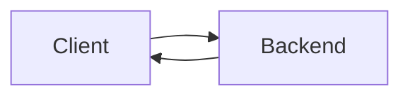

# Overview
Web application which provides bus services and arrival times for a bus stop. Functionality includes account creation, saving of favourite bus stops, saving and sending bus arrivial times as a notification at specified times (eg every 8.30 AM on weekdays). Also has a Telegram bot interface, users can get bus arrival times, add/delete notifications in Telegram.

(Database functions turned off in the deployment due to cost constraints)

# App Design
Frontend (Angular/Typescript): Single-page web application, ability to get bus arrival times without login. All other functions require login/account creation.

Backend (SpringBoot/Java): Processes HTTP requests from client, authenticate logins and generates JWT. Sends HTTP requests to the LTA API to get bus arrival information. Also contains logic for Telegram bot.

Persistance (MySQL): Stores user login information, saved notifications and favourite bus stops.

Push notifications (Firebase notifications): Backend sends HTTP request to Firebase at time of notification.

Telegram Bot (Java): Allows the user to access the app functionalities using Telegram.

